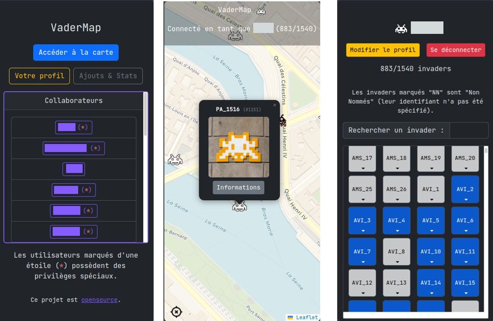

**EDIT 20/11/2025 : Par manque d'activité sur la version du site hébergée par moi-même, j'ai décidé de l'arrêter. Le développement continuera sûrement si des issues sont créées, et le code n'est pas encore déprécié.**

# VaderMap

Voici le code source d'un site que j'ai développé à destination d'un comité restreint, constitué d'une carte du monde, modifiée pour favoriser l'entraide de groupe autour de la recherche des [Space Invaders](https://www.space-invaders.com/world/) dans le monde entier.

Voici à quoi ressemble le site lorqu'il est mis en ligne, accessible par l'administrateur et les invités :



## Installation

### Fichier `.env`

Tout d'abord, il faut créer un fichier `.env` à la racine du projet, contenant :

```conf
SECRET=une_longue_chaine_secrete
DB_URI=sqlite:///db.sqlite/ # Ou toute autre url à votre goût.

MASTER_KEY=la_clef_de_création_de_compte_pour_invités
VERSION=V2.3.2
```

### Premier lancement

Au premier lancement, la base de donnée **n'est pas initialisée** ! Pour l'initialiser, il faut executer les instructions suivantes dans un terminal situé à la racine du projet :

```python
$ python # Ou python3
>>> from src import __app__, db
>>> with __app__.app_context():
        db.create_all()
>>> exit()
```

### Fichier `chpriv.py` et privilèges invités

Lorsque le site est fonctionnel, il est alors possible d'inviter de nouveaux utilisateurs à créer leur compte (en leur fournissant la `MASTER_KEY` écrite dans `.env`). Par défaut, un utilisateur n'a pas la permission de supprimer les _invaders_ des autres, si vous voulez la lui donner, vous pouvez executer l'instruction suivante dans un terminal :

```bash
$ chpriv.py --privilege=1 --user=username
```

- `--privilege` : 0 correspond au privilège par défaut, 1 et 2 correspondent (pour l'instant) au même privilège (énoncé au dessus), préférez donc 1 pour l'instant.
- `--user` : Le nom de l'utilisateur concerné.
